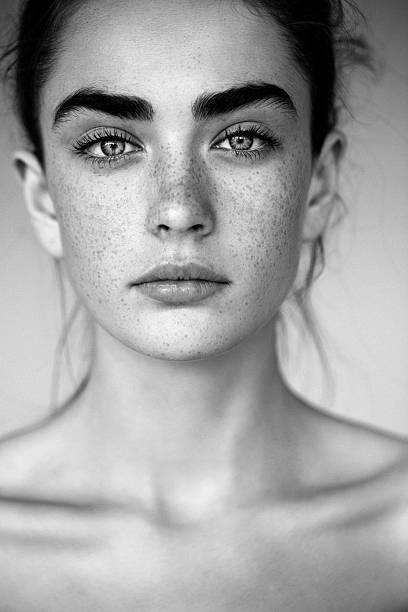
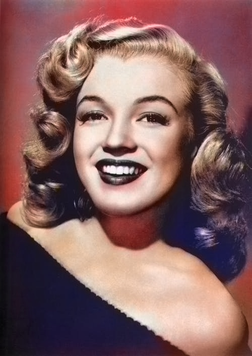

# Colorizer Bot

This Deep Learning Project can colorize black & white images with Python.
This project in based [Richzhang paper](https://richzhang.github.io/colorization/). I intend to use this algorithm as a twitter bot

## Download the caffemodel and  prototxt 
    Models
    $ wget http://eecs.berkeley.edu/~rich.zhang/projects/2016_colorization/files/demo_v2/colorization_release_v2.caffemodel -O ./core/models/colorization_release_v2.caffemodel
    
    Prototxt
    $ wget https://raw.githubusercontent.com/richzhang/colorization/master/colorization/models/colorization_deploy_v2.prototxt -O ./core/models/colorization_deploy_v2.prototxt

## Running

    Install dependecies
    $ pip install -r requirements.txt
    $ python app.py

## Results

    

        
    

    

        
    

## How does it work ?

## TODO

* Implement as TwitterBot
* Better Engine structure
* Tests

---

#### References
- https://richzhang.github.io/colorization/
- https://arxiv.org/abs/1603.08511
- https://developer.twitter.com/en/docs